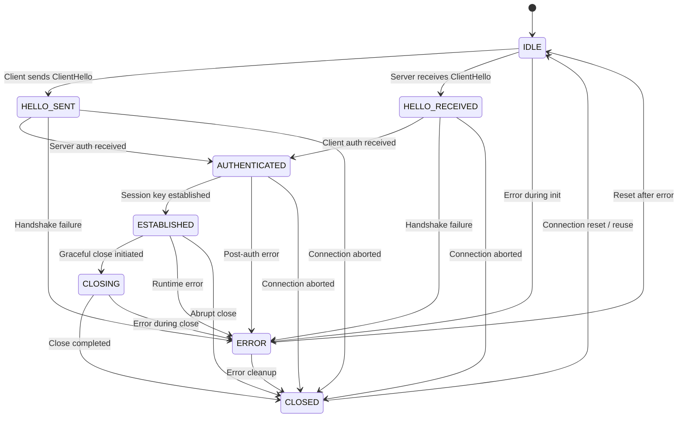
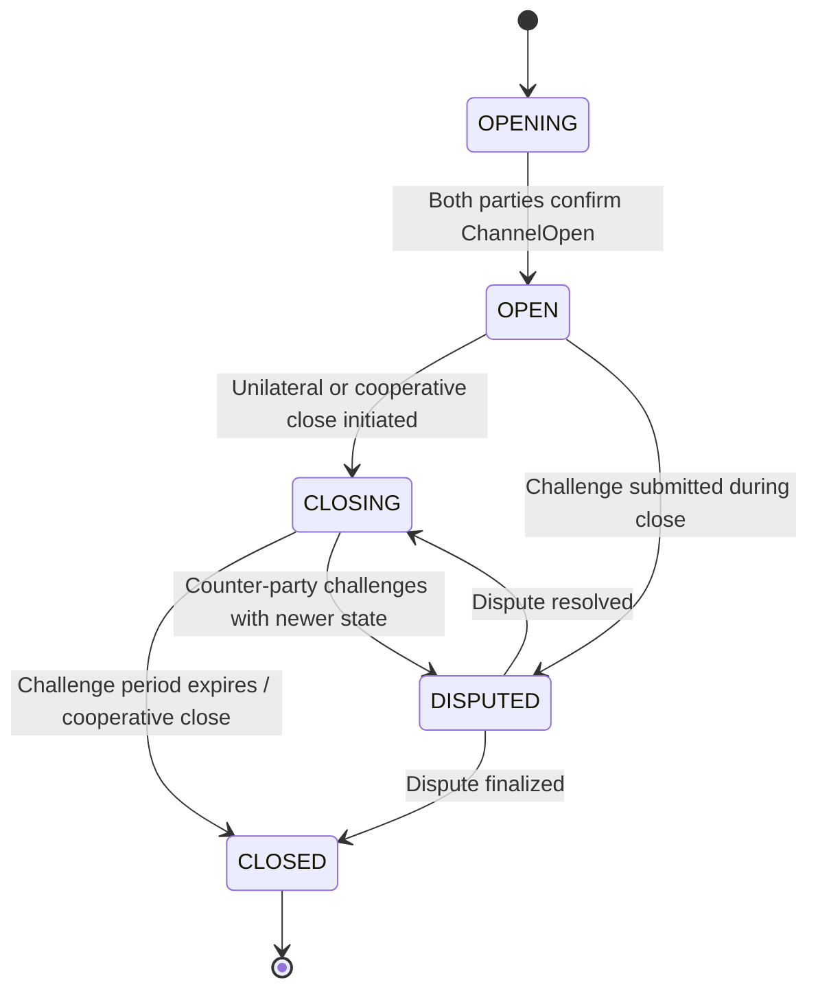

# QASP Protocol Specification

**Version:** 1.0
**Status:** Draft
**Date:** 2026-03-06

## 1. Introduction

The Quantum-Aware Security Protocol (QASP) is a post-quantum secure communication
protocol designed for autonomous AI agent interactions. QASP provides mutual
authentication, confidentiality, integrity, capability-based access control,
metered resource usage, and payment settlement between agents.

The key words "MUST", "MUST NOT", "REQUIRED", "SHALL", "SHALL NOT", "SHOULD",
"SHOULD NOT", "RECOMMENDED", "MAY", and "OPTIONAL" in this document are to be
interpreted as described in [RFC 2119](https://www.rfc-editor.org/rfc/rfc2119).

## 2. Protocol Overview

QASP operates in four phases:

1. **QASP-Shake** -- A three-message handshake establishing a mutually
   authenticated, post-quantum secure session.
2. **Resource Negotiation** -- Capability token issuance, price negotiation,
   and resource access granting.
3. **Metered Operation** -- Signed meter reports, acknowledgments, and
   constraint enforcement during resource usage.
4. **Settlement** -- Off-chain payment channel state updates and cooperative
   or unilateral close.

All wire messages are carried in QASP frames (Section 3) and encoded using
CBOR ([RFC 8949](https://www.rfc-editor.org/rfc/rfc8949)).

## 3. Frame Format

Every QASP message is transmitted inside a framed binary envelope that provides
type identification, length delimitation, and integrity protection.

### 3.1. Wire Layout

```
 0                   1                   2                   3
 0 1 2 3 4 5 6 7 8 9 0 1 2 3 4 5 6 7 8 9 0 1 2 3 4 5 6 7 8 9 0 1
+-+-+-+-+-+-+-+-+-+-+-+-+-+-+-+-+-+-+-+-+-+-+-+-+-+-+-+-+-+-+-+-+
|     Magic (0x51 0x41 "QA")    |   Version     |     Type      |
+-+-+-+-+-+-+-+-+-+-+-+-+-+-+-+-+-+-+-+-+-+-+-+-+-+-+-+-+-+-+-+-+
|                     Payload Length (32-bit)                    |
+-+-+-+-+-+-+-+-+-+-+-+-+-+-+-+-+-+-+-+-+-+-+-+-+-+-+-+-+-+-+-+-+
|                                                               |
+                    Payload (CBOR-encoded)                      +
|                          (variable)                           |
+-+-+-+-+-+-+-+-+-+-+-+-+-+-+-+-+-+-+-+-+-+-+-+-+-+-+-+-+-+-+-+-+
|                                                               |
+                   HMAC-SHA-384 (48 bytes)                     +
|                                                               |
+-+-+-+-+-+-+-+-+-+-+-+-+-+-+-+-+-+-+-+-+-+-+-+-+-+-+-+-+-+-+-+-+
```

### 3.2. Header Fields

| Offset | Size    | Field          | Description                                    |
|--------|---------|----------------|------------------------------------------------|
| 0      | 2 bytes | Magic          | `0x51 0x41` (ASCII "QA"). Fixed protocol marker.|
| 2      | 1 byte  | Version        | `0x01` for QASP v1.0.                          |
| 3      | 1 byte  | Type           | `MessageType` value (Table I).                 |
| 4      | 4 bytes | Payload Length | Big-endian uint32. Length of the CBOR payload.  |
| 8      | N bytes | Payload        | CBOR-encoded message fields.                   |
| 8+N    | 48 bytes| HMAC           | HMAC-SHA-384 over octets [0..8+N).             |

- **Total header size:** 8 bytes.
- **Total overhead per frame:** 8 (header) + 48 (HMAC) = 56 bytes.
- The `message_type` field from the Message dataclass is carried in the frame
  header and MUST NOT be repeated in the CBOR payload.
- The HMAC key is the pre-shared HMAC key during handshake and the HKDF-derived
  session key after handshake completion.

### 3.3. Integrity Verification

Receivers MUST:

1. Validate that `Magic == 0x5141`.
2. Validate that `Version == 0x01`.
3. Parse `Type` as a known `MessageType` (reject unknown types).
4. Read exactly `Payload Length` bytes of payload.
5. Compute HMAC-SHA-384 over the 8-byte header concatenated with the payload.
6. Compare the computed HMAC against the received 48-byte HMAC using
   constant-time comparison.
7. Reject the frame if any check fails.

## 4. Message Types

QASP defines 22 message types organized into functional groups.

### Table I -- Message Type Registry

| Code   | Name               | Group                | Direction        |
|--------|--------------------|----------------------|------------------|
| `0x01` | CLIENT_HELLO       | Handshake            | Client -> Server |
| `0x02` | SERVER_HELLO       | Handshake            | Server -> Client |
| `0x03` | CLIENT_AUTH        | Handshake            | Client -> Server |
| `0x04` | APPLICATION_DATA   | Application Data     | Bidirectional    |
| `0x05` | TOKEN_REVOCATION   | Token Revocation     | Bidirectional    |
| `0x06` | REVOCATION_NOTICE  | Token Revocation     | Bidirectional    |
| `0x07` | RESOURCE_REQUEST   | Resource Management  | Client -> Server |
| `0x08` | RESOURCE_GRANT     | Resource Management  | Server -> Client |
| `0x09` | METER_ACK          | Resource Management  | Client -> Server |
| `0x0A` | RESOURCE_SUSPEND   | Resource Management  | Server -> Client |
| `0x0B` | RESOURCE_DENY      | Resource Management  | Server -> Client |
| `0x0C` | RESOURCE_RELEASE   | Resource Management  | Client -> Server |
| `0x0D` | DISPUTE_OPEN       | Dispute Resolution   | Bidirectional    |
| `0x0E` | DISPUTE_EVIDENCE   | Dispute Resolution   | Bidirectional    |
| `0x0F` | DISPUTE_VERDICT    | Dispute Resolution   | Arbiter -> Peers |
| `0x10` | METER_REPORT       | Metering             | Server -> Client |
| `0x11` | CHANNEL_OPEN       | Channel Management   | Bidirectional    |
| `0x12` | CHANNEL_CLOSE      | Channel Management   | Bidirectional    |
| `0x13` | PRICE_REQUEST      | Pricing              | Client -> Server |
| `0x14` | ALERT              | Alerts               | Bidirectional    |
| `0x15` | PRICE_OFFER        | Pricing              | Server -> Client |
| `0x16` | PRICE_ACCEPT       | Pricing              | Client -> Server |

Codes `0x17`--`0xFF` are RESERVED for future use. Implementations MUST reject
frames with unknown type codes.

### 4.1. CDDL Schemas

All message payloads are CBOR maps. The following schemas use CDDL
([RFC 8610](https://www.rfc-editor.org/rfc/rfc8610)).

#### 4.1.1. Handshake Messages

```cddl
; 0x01 CLIENT_HELLO
ClientHello = {
    protocol_version : [uint, uint],       ; (major, minor)
    client_random    : bstr .size 32,      ; 32-byte nonce
    kem_public_key   : bstr,               ; ML-KEM-768 or hybrid public key
    sig_public_key   : bstr,               ; ML-DSA-65 public key
    cipher_suites    : [+ uint],           ; list of 16-bit suite IDs
    extensions       : bstr,               ; reserved for future extensions
}

; 0x02 SERVER_HELLO
ServerHello = {
    protocol_version      : [uint, uint],
    server_random         : bstr .size 32,
    kem_ciphertext        : bstr,          ; KEM ciphertext encapsulating shared secret
    kem_public_key        : bstr,          ; server KEM public key for client encap
    sig_public_key        : bstr,          ; ML-DSA-65 public key
    selected_cipher_suite : uint,          ; 16-bit suite ID
    signature             : bstr,          ; ML-DSA-65 over transcript
    extensions            : bstr,
}

; 0x03 CLIENT_AUTH
ClientAuth = {
    kem_ciphertext : bstr,                 ; KEM ciphertext for server's public key
    signature      : bstr,                 ; ML-DSA-65 over transcript
    certificate    : bstr,                 ; optional client certificate
}
```

#### 4.1.2. Application Data

```cddl
; 0x04 APPLICATION_DATA
ApplicationData = {
    encrypted_data  : bstr,                ; AES-256-GCM ciphertext
    sequence_number : uint,                ; monotonic counter for replay protection
}
```

#### 4.1.3. Token Revocation Messages

```cddl
; 0x05 TOKEN_REVOCATION
TokenRevocation = {
    token_id        : bstr,
    revocation_time : uint,                ; Unix timestamp
    reason          : uint,                ; revocation reason code
    signature       : bstr,                ; issuer signature
    urgency         : uint,                ; 0=critical, 1=normal, 2=planned
    scheduled_time  : uint,                ; Unix timestamp for planned revocations
    issuer_did      : tstr,                ; DID of the revoker
}

; 0x06 REVOCATION_NOTICE
RevocationNotice = {
    token_id          : bstr,
    revocation_time   : uint,
    issuer_id         : bstr,
    signature         : bstr,
    urgency           : uint,              ; 0=critical, 1=normal, 2=planned
    cascade_token_ids : [* bstr],          ; descendant tokens also revoked
}
```

#### 4.1.4. Resource Management Messages

```cddl
; 0x07 RESOURCE_REQUEST
ResourceRequest = {
    request_id       : bstr,
    resource_type    : tstr,
    resource_id      : bstr,
    permissions      : uint,               ; permission bitmask
    duration         : uint,               ; requested duration in seconds
    payment_offer    : bstr,               ; optional payment offer
    capability_tokens : [* bstr],          ; CBOR-encoded tokens for aggregation
}

; 0x08 RESOURCE_GRANT
ResourceGrant = {
    request_id          : bstr,
    token               : bstr,            ; capability token granting access
    granted_permissions : uint,            ; granted permission bitmask
    expiration          : uint,            ; token expiration timestamp
    meter_id            : bstr,            ; meter identifier for usage tracking
}

; 0x09 METER_ACK
MeterAck = {
    meter_id       : bstr,
    acked_sequence : uint,                 ; acknowledged sequence number
    acked_usage    : uint,                 ; acknowledged usage value
    signature      : bstr,                 ; provider signature for receipt
}

; 0x0A RESOURCE_SUSPEND
ResourceSuspend = {
    token_id    : bstr,
    reason      : uint,                    ; suspension reason code (Section 9.2)
    resume_time : uint,                    ; expected resume timestamp (0=indefinite)
}

; 0x0B RESOURCE_DENY
ResourceDeny = {
    request_id  : bstr,
    reason      : uint,                    ; denial reason code
    message     : tstr,                    ; human-readable explanation
    retry_after : uint,                    ; seconds before retrying (0=don't retry)
}

; 0x0C RESOURCE_RELEASE
ResourceRelease = {
    token_id    : bstr,
    final_usage : uint,                    ; final usage count for settlement
    signature   : bstr,                    ; signature confirming release
}
```

#### 4.1.5. Dispute Resolution Messages

```cddl
; 0x0D DISPUTE_OPEN
DisputeOpen = {
    dispute_id    : bstr,
    token_id      : bstr,
    dispute_type  : uint,
    claimed_value : uint,
    evidence_hash : bstr,                  ; SHA-384 hash of initial evidence
}

; 0x0E DISPUTE_EVIDENCE
DisputeEvidence = {
    dispute_id    : bstr,
    evidence_type : uint,
    evidence_data : bstr,
    signature     : bstr,
}

; 0x0F DISPUTE_VERDICT
DisputeVerdict = {
    dispute_id    : bstr,
    verdict       : uint,
    awarded_value : uint,
    arbiter_id    : bstr,
    signature     : bstr,                  ; arbiter's ML-DSA-65 signature
}
```

#### 4.1.6. Metering Message

```cddl
; 0x10 METER_REPORT
MeterReport = {
    meter_id        : bstr,
    sequence_number : uint,                ; report sequence number
    usage_count     : uint,                ; number of usage units
    usage_bytes     : uint,                ; number of bytes used
    cost            : uint,                ; cumulative cost (smallest currency units)
    timestamp       : uint,                ; Unix timestamp
    signature       : bstr,                ; non-repudiation signature
}
```

#### 4.1.7. Channel Management Messages

```cddl
; 0x11 CHANNEL_OPEN
ChannelOpen = {
    channel_id      : bstr,
    channel_type    : uint,
    initial_balance : uint,
    peer_id         : bstr,
    timeout         : uint,                ; channel timeout in seconds
}

; 0x12 CHANNEL_CLOSE
ChannelClose = {
    channel_id      : bstr,
    final_balance_a : uint,
    final_balance_b : uint,
    close_reason    : uint,
    signatures      : [bstr, bstr],        ; both parties' signatures
}
```

#### 4.1.8. Pricing and Alert Messages

```cddl
; 0x13 PRICE_REQUEST
PriceRequest = {
    request_id    : bstr,
    resource_type : tstr,
    resource_id   : bstr,
    quantity      : uint,
    duration      : uint,                  ; duration in seconds
}

; 0x14 ALERT
Alert = {
    level                : uint,           ; 1=warning, 2=fatal
    description          : uint,           ; alert code (Table V)
    message              : tstr,           ; human-readable
    related_message_type : uint,           ; MessageType that triggered this alert
}

; 0x15 PRICE_OFFER
PriceOffer = {
    request_id    : bstr,
    resource_type : tstr,
    unit_price    : uint,                  ; smallest currency denomination
    currency      : tstr,                  ; e.g. "credits"
    valid_from    : uint,                  ; Unix timestamp
    valid_until   : uint,                  ; Unix timestamp
    signature     : bstr,                  ; ML-DSA-65 over CBOR(fields - signature)
}

; 0x16 PRICE_ACCEPT
PriceAccept = {
    request_id      : bstr,
    offer_signature : bstr,                ; echoes PriceOffer.signature
    resource_type   : tstr,
    unit_price      : uint,
    currency        : tstr,
    valid_from      : uint,
    valid_until     : uint,
    signature       : bstr,                ; ML-DSA-65 from the accepter
}
```

### 4.2. Capability Token

Capability tokens are CBOR-encoded, ML-DSA-65 signed authorization objects that
travel in `RESOURCE_REQUEST.capability_tokens`, `RESOURCE_GRANT.token`, or as
standalone payloads in `APPLICATION_DATA`.

```cddl
CapabilityToken = {
    token_id             : bstr,           ; SHA-384(issuer+nonce)[:32]
    issuer_did           : tstr,           ; "did:qasp:<identifier>"
    subject_did          : tstr,           ; DID of the token holder
    audience_did         : tstr / nil,     ; DID of the service provider
    resource_uri         : tstr,           ; ARM resource URI (Section 5)
    verbs                : [+ tstr],       ; e.g. ["read","write","execute"]
    constraints          : Constraints,
    issued_at            : tstr,           ; ISO 8601 timestamp
    nonce                : bstr .size 16,
    signature            : bstr,           ; ML-DSA-65 signature
    ? parent_token_hash  : bstr / nil,     ; SHA-384 hash of parent token
    ? max_delegation_depth    : uint,      ; max levels of delegation (default 0)
    ? delegation_chain_length : uint,      ; current position in chain (default 0)
    ? toolchain_position      : uint,      ; position in toolchain (default 0)
}

Constraints = {
    ? not_before         : tstr / nil,     ; ISO 8601 timestamp
    ? not_after          : tstr / nil,     ; ISO 8601 timestamp
    ? quantity_limit     : uint / nil,     ; max consumable quantity
    ? quantity_unit      : tstr,           ; e.g. "vCPU-h", "GB"
    ? rate_limit         : uint / nil,     ; max ops per rate_period_seconds
    ? rate_period_seconds : uint,          ; rate period (default 3600)
    ? max_spend          : uint / nil,     ; maximum spend
    ? spend_currency     : tstr,           ; e.g. "USD", "credits"
    ? data_scope         : [* tstr] / nil, ; data scope identifiers
    ? purpose            : tstr / nil,     ; intended use description
    ? allowed_toolchain  : [* tstr] / nil, ; ordered tool class names
}
```

#### 4.2.1. Token Lifecycle

- **Issuance:** The issuer signs `CBOR(token fields - signature)` with ML-DSA-65.
  `token_id = SHA-384(issuer_did || nonce)[:32]`.
- **Delegation:** A holder creates a child token with `parent_token_hash` set to
  `SHA-384(parent.to_cbor() || parent.signature)`. The child MUST have
  `delegation_chain_length = parent.delegation_chain_length + 1` and
  `delegation_chain_length <= max_delegation_depth`.
- **Attenuation:** Child tokens MUST have `verbs` that are a subset of the
  parent's verbs and constraints that are tighter (Section 4.2.2).
- **Aggregation:** Multiple tokens held by the same subject can be aggregated:
  verbs are unioned, resource URIs are unioned, and constraints are intersected
  (tightest wins).
- **Revocation:** Via `TOKEN_REVOCATION` (0x05) and `REVOCATION_NOTICE` (0x06)
  messages, with cascade support for descendant tokens.

#### 4.2.2. Constraint Tightening Rules

When attenuating a token, each child constraint MUST be tighter than or equal
to the parent:

| Field            | Tighter means               |
|------------------|-----------------------------|
| `not_before`     | >= parent `not_before`       |
| `not_after`      | <= parent `not_after`        |
| `quantity_limit`  | <= parent `quantity_limit`   |
| `rate_limit`     | <= parent `rate_limit`       |
| `max_spend`      | <= parent `max_spend`        |
| `data_scope`     | subset of parent `data_scope`|
| `purpose`        | must match parent `purpose`  |
| `allowed_toolchain` | contiguous ordered sublist of parent |

## 5. Agent Resource Model (ARM) URIs

Resources are identified using ARM URIs with the following syntax.

### 5.1. ABNF Grammar

```abnf
arm-uri     = "arm://" provider "/" type "/" id [ "/" sub-path ]
provider    = segment
type        = segment
id          = segment
sub-path    = segment *( "/" segment )
segment     = 1*( unreserved )
unreserved  = ALPHA / DIGIT / "-" / "_" / "." / "~"
```

### 5.2. Examples

```
arm://cloud-compute/gpu/a100/instance-1
arm://storage/blob/dataset-7
arm://llm-provider/inference/gpt-4o
arm://code-exec/sandbox/python3.14
```

The `provider` component identifies the service provider namespace. The `type`
component identifies the resource category. The `id` component identifies the
specific resource. Optional `sub-path` components provide further specificity.

## 6. DID Identity: `did:qasp`

QASP agents identify themselves using the `did:qasp` DID method.

### 6.1. DID Format

```
did:qasp:<identifier>
```

Where `<identifier>` = `Base58btc(SHA-384(ML-DSA-65 public key)[0:32])`.

### 6.2. DID Document

DID documents are JSON-LD objects with contexts:
- `https://www.w3.org/ns/did/v1`
- `https://w3id.org/security/suites/mldsa-2025/v1`

Verification methods use type `MLDSAVerificationKey2025` with
`publicKeyMultibase` encoding: `"z" || Base58btc(0x1318 || public_key)` where
`0x1318` is the multicodec prefix for ML-DSA-65.

### 6.3. Key Rotation

DID documents include `nextKeyHash` (SHA-384 hash of the next public key) and
`keyVersion` (monotonically increasing integer). Key rotation uses CBOR-encoded
dual-signature proofs (signed by both old and new keys).

## 7. Cipher Suites

QASP defines three cipher suites identified by 16-bit IDs.

### Table II -- Cipher Suite Registry

| ID       | Name                 | KEM Algorithm       | Signature Algorithm  | AEAD          | KDF           |
|----------|----------------------|---------------------|----------------------|---------------|---------------|
| `0x0001` | PQ-Strict            | ML-KEM-768          | ML-DSA-65            | AES-256-GCM   | HKDF-SHA-384  |
| `0x0002` | Hybrid-Transition    | X25519 + ML-KEM-768 | Ed25519 + ML-DSA-65  | AES-256-GCM   | HKDF-SHA-384  |
| `0x0003` | Classical-Compat     | X25519              | Ed25519              | AES-256-GCM   | HKDF-SHA-384  |

Suite IDs `0x0004`--`0xFFFF` are RESERVED.

### 7.1. Suite Properties

| Property                    | PQ-Strict | Hybrid-Transition | Classical-Compat |
|-----------------------------|-----------|-------------------|------------------|
| Post-quantum KEM            | Yes       | Yes (hybrid)      | No               |
| Post-quantum signatures     | Yes       | Yes (dual)        | No               |
| Classical signatures        | No        | Yes (dual)        | Yes              |
| Hybrid KEM                  | No        | Yes               | No               |

### 7.2. Post-Quantum Suite Set

Suites `0x0001` and `0x0002` constitute the **PQ-capable** set. Suite `0x0003`
constitutes the **Classical-only** set.

### 7.3. Downgrade Resistance

A server whose configuration includes any PQ-capable suite MUST reject a
`ClientHello` that offers only Classical-only suites. The server MUST respond
with `HandshakeFailure(UPGRADE_REQUIRED, alert_code=72)` to prevent downgrade
attacks. See Section 8.3.

## 8. QASP-Shake Handshake

QASP-Shake is a three-message, mutually-authenticated key exchange using
post-quantum or hybrid cryptography.

### 8.1. Handshake Message Flow

```
Client                                         Server
  |                                               |
  |  [IDLE]                                [IDLE] |
  |                                               |
  |  (1) ClientHello                              |
  |   protocol_version, client_random,            |
  |   kem_public_key, sig_public_key,             |
  |   cipher_suites, extensions                   |
  | --------------------------------------------> |
  |  [HELLO_SENT]                 [HELLO_RECEIVED] |
  |                                               |
  |                          (2) ServerHello      |
  |   protocol_version, server_random,            |
  |   kem_ciphertext(S->C), kem_public_key,       |
  |   sig_public_key, selected_cipher_suite,      |
  |   signature(transcript), extensions           |
  | <-------------------------------------------- |
  |                                               |
  |  (3) ClientAuth                               |
  |   kem_ciphertext(C->S), signature(transcript),|
  |   certificate                                 |
  | --------------------------------------------> |
  |  [ESTABLISHED]                 [ESTABLISHED]  |
  |                                               |
```

### 8.2. Handshake Detail

#### Message 1: ClientHello (0x01)

The client:
1. Generates a 32-byte `client_random` nonce.
2. Includes its KEM public key. For Hybrid-Transition suites, this is the
   concatenated `X25519 || ML-KEM-768` public key. For PQ-Strict, this is the
   ML-KEM-768 public key only.
3. Includes its ML-DSA-65 signature public key.
4. Lists supported cipher suites in preference order.
5. Populates the transcript: `version || client_nonce || kem_pk || sig_pk || suites`.

#### Message 2: ServerHello (0x02)

The server:
1. Validates the protocol version. On mismatch: `VERSION_MISMATCH` (alert 70).
2. Finds a common cipher suite. On failure: `SUITE_MISMATCH` (alert 71).
3. Enforces downgrade resistance (Section 7.3). If applicable: `UPGRADE_REQUIRED` (alert 72).
4. Selects the preferred common suite (server preference order).
5. Generates a 32-byte `server_random` nonce.
6. Performs KEM encapsulation against the client's public key, producing
   `kem_ciphertext` and `shared_secret_S`.
7. Populates the transcript with ServerHello fields (pre-signature).
8. Signs the transcript `(ClientHello || ServerHello_pre_sig)` with ML-DSA-65.
9. Appends the signature to the transcript.

#### Message 3: ClientAuth (0x03)

The client:
1. Validates the protocol version and cipher suite selection.
2. Verifies the server's ML-DSA-65 signature over the transcript. On failure: `AUTH_FAILED` (alert 51).
3. Decapsulates the server's `kem_ciphertext` to recover `shared_secret_S`.
   On failure: `KEM_FAILED` (alert 50).
4. Performs KEM encapsulation against the server's `kem_public_key`, producing
   `kem_ciphertext_C` and `shared_secret_C`.
5. Signs the full transcript (including server signature) with ML-DSA-65.
6. Sends `ClientAuth` with `kem_ciphertext_C`, signature, and optional certificate.

#### Session Key Derivation

Both parties compute the session key identically:

```
combined_shared = shared_secret_S || shared_secret_C

For Hybrid-Transition suites:
  X25519_ss  = SHA-256(X25519_S || X25519_C)
  ML-KEM_ss  = SHA-256(ML-KEM_S || ML-KEM_C)
  IKM = ML-KEM_ss || X25519_ss

For PQ-Strict suites:
  ML-KEM_ss  = SHA-256(combined_shared)
  X25519_ss  = 0x00 * 32
  IKM = ML-KEM_ss || X25519_ss

session_key = HKDF-SHA-384(
    IKM  = IKM,
    salt = client_nonce || server_nonce,
    info = "QASP-v1",
    L    = 32                              ; AES-256 key size
)

session_id = SHA-384(full_transcript)[:32]
```

After key derivation, the HMAC key used for frame integrity switches from the
pre-shared key to the derived `session_key`.

### 8.3. Nonce Construction for AES-256-GCM

Application data is encrypted with AES-256-GCM using a TLS 1.3-style
counter-based nonce:

```
nonce_iv = HKDF-SHA-384(session_key, info="qasp_nonce_iv", L=4)
nonce    = nonce_iv || sequence_number_be64      ; 12 bytes total
AAD      = message_type_byte || sequence_number_be64
```

### 8.4. Handshake Configuration

| Parameter              | Default   | Description                                      |
|------------------------|-----------|--------------------------------------------------|
| `protocol_version`     | (1, 0)    | Protocol version tuple.                          |
| `supported_cipher_suites` | (0x0002,) | Default is Hybrid-Transition.                 |
| `enable_hybrid`        | true      | Controls KEM public key format in ClientHello.   |
| `initial_timeout_ms`   | 5000      | Initial handshake timeout.                       |
| `max_timeout_ms`       | 60000     | Maximum timeout after backoff.                   |
| `backoff_multiplier`   | 2.0       | Exponential backoff multiplier.                  |
| `max_retries`          | 3         | Maximum retry attempts.                          |

Retries are permitted for `VERSION_MISMATCH` and `TIMEOUT` errors. Retries
MUST NOT be attempted for `AUTH_FAILED` or `KEM_FAILED` errors.

## 9. Connection State Machine

### 9.1. QASP Connection States (8 states)



### Table III -- State Transition Matrix

| From State       | Valid Next States                             |
|------------------|-----------------------------------------------|
| IDLE             | HELLO_SENT, HELLO_RECEIVED, ERROR             |
| HELLO_SENT       | AUTHENTICATED, ERROR, CLOSED                  |
| HELLO_RECEIVED   | AUTHENTICATED, ERROR, CLOSED                  |
| AUTHENTICATED    | ESTABLISHED, ERROR, CLOSED                    |
| ESTABLISHED      | CLOSING, ERROR, CLOSED                        |
| CLOSING          | CLOSED, ERROR                                 |
| CLOSED           | IDLE                                          |
| ERROR            | CLOSED, IDLE                                  |

Total: **8 states**, **14 valid transitions**. Any transition not listed in
Table III MUST raise a `StateTransitionError`.

### 9.2. Resource States

Resources tracked by the metering system follow a separate lifecycle:

```
PENDING --> ACTIVE --> SUSPENDED --> RELEASED
               |                       ^
               +--------> RELEASED ----+
               |
               +--------> DENIED
```

States: PENDING, ACTIVE, SUSPENDED, RELEASED, DENIED.

### 9.3. Suspension Reason Codes

| Code | Name               | Description                              |
|------|--------------------|------------------------------------------|
| 1    | BUDGET_EXHAUSTED   | `max_spend` constraint exceeded.         |
| 2    | QUANTITY_EXCEEDED   | `quantity_limit` constraint exceeded.     |
| 3    | RATE_LIMIT_HIT     | Rate limit constraint exceeded.          |
| 4    | TIME_EXPIRED       | `not_after` constraint exceeded.          |
| 5    | MANUAL             | Manual suspension by operator.           |

## 10. Payment Channel

### 10.1. Payment Channel States (5 states)



### Table IV -- Payment Channel State Transitions

| From State | Valid Next States           |
|------------|-----------------------------|
| OPENING    | OPEN                        |
| OPEN       | CLOSING, DISPUTED           |
| CLOSING    | CLOSED, DISPUTED            |
| DISPUTED   | CLOSING, CLOSED             |
| CLOSED     | (terminal)                  |

### 10.2. Channel Lifecycle

1. **Open:** One party sends `CHANNEL_OPEN` (0x11) with `initial_balance`.
   The counterparty responds with its own `CHANNEL_OPEN` containing its balance.
2. **State Updates:** Off-chain signed state updates (`ChannelStateUpdate`)
   transfer balance between parties. Each update includes:
   - `channel_id`, `sequence_number` (monotonically increasing),
     `agent_balance`, `server_balance`, `prev_hash` (SHA-384 hash chain),
     `timestamp`, `agent_signature`, `server_signature`.
   - Both parties MUST countersign each state update.
3. **Cooperative Close:** One party sends `CHANNEL_CLOSE` (0x12) with final
   balances. The counterparty countersigns. Both transition to CLOSED.
4. **Unilateral Close:** One party publishes the latest state update and
   initiates a challenge period of **300 seconds** (`CHALLENGE_PERIOD_SECONDS`).
5. **Challenge:** During the challenge period, the counterparty MAY submit a
   state update with a higher `sequence_number` to dispute the close.
6. **Finalization:** After the challenge period expires without successful
   challenge, the channel transitions to CLOSED with final settlement.

### 10.3. Price Negotiation

Price negotiation proceeds via a three-message exchange:

1. **PriceRequest (0x13):** Client requests pricing for a resource type,
   quantity, and duration.
2. **PriceOffer (0x15):** Server responds with `unit_price`, `currency`,
   validity window, and ML-DSA-65 signature over `CBOR(fields - signature)`.
3. **PriceAccept (0x16):** Client echoes the offer signature and signs
   acceptance. The result is a `PriceSchedule` binding both parties.

Close reasons:

| Constant                     | Value         |
|------------------------------|---------------|
| `CLOSE_REASON_COOPERATIVE`   | "cooperative" |
| `CLOSE_REASON_UNILATERAL`    | "unilateral"  |
| `CLOSE_REASON_TIMEOUT`       | "timeout"     |

## 11. Metering Protocol

### 11.1. Metering Flow

```
Client (Agent)                              Server (Provider)
  |                                               |
  |  ResourceRequest (0x07)                       |
  | --------------------------------------------> |
  |                                               |
  |                    ResourceGrant (0x08)        |
  |              (includes meter_id, token)        |
  | <-------------------------------------------- |
  |                                               |
  |             [ resource usage occurs ]          |
  |                                               |
  |                    MeterReport (0x10)          |
  |              (signed, seq, usage, cost)        |
  | <-------------------------------------------- |
  |                                               |
  |  MeterAck (0x09)                              |
  |              (signed, acked_seq, usage)        |
  | --------------------------------------------> |
  |                                               |
  |         ...repeated report/ack cycles...      |
  |                                               |
  |  ResourceRelease (0x0C)                       |
  |              (signed, final_usage)             |
  | --------------------------------------------> |
  |                                               |
```

### 11.2. Signed Messages

Both `MeterReport` and `MeterAck` carry ML-DSA-65 signatures for
non-repudiation. The signature covers `CBOR(fields - signature)`:

- **MeterReport signable:** `CBOR({meter_id, sequence_number, usage_count,
  usage_bytes, cost, timestamp})`
- **MeterAck signable:** `CBOR({meter_id, acked_sequence, acked_usage})`
- **ResourceRelease signable:** `CBOR({token_id, final_usage})`

### 11.3. Constraint Enforcement

After each `MeterReport`, the agent checks cumulative usage against the
`Constraints` attached to the resource grant:

| Constraint       | Check                                       | Suspend Reason      |
|------------------|---------------------------------------------|---------------------|
| `quantity_limit` | `cumulative_units > quantity_limit`          | QUANTITY_EXCEEDED    |
| `max_spend`      | `cumulative_cost > max_spend`               | BUDGET_EXHAUSTED     |
| `not_after`      | `current_time > not_after`                  | TIME_EXPIRED         |

If any constraint is violated, the agent responds with `RESOURCE_SUSPEND`
(0x0A) instead of `METER_ACK`.

## 12. Error Codes and Alert Protocol

### Table V -- Handshake Error Types and Alert Codes

| Error Type         | Alert Code | Level | Recovery Procedure                                           |
|--------------------|------------|-------|--------------------------------------------------------------|
| KEM_FAILED         | 50         | Fatal | Do not retry. Report to operator. Possible key compromise.   |
| AUTH_FAILED         | 51         | Fatal | Do not retry. Verify peer identity out-of-band.              |
| VERSION_MISMATCH   | 70         | Fatal | Retry permitted. Negotiate version with updated ClientHello. |
| SUITE_MISMATCH     | 71         | Fatal | Retry permitted. Expand supported cipher suites.             |
| UPGRADE_REQUIRED   | 72         | Fatal | Upgrade to PQ-capable suite before reconnecting.             |
| TIMEOUT            | --         | --    | Retry with exponential backoff (2x, capped at 60s).          |

### Table VI -- Capability Token Alert Codes

| Error Type                   | Alert Code | Description                                    |
|------------------------------|------------|------------------------------------------------|
| InvalidDelegationChainError  | 44         | Delegation chain verification failed.          |
| TokenExpiredError            | 45         | Token `not_after` constraint violated.          |
| TokenNotYetValidError        | 46         | Token `not_before` constraint violated.         |
| DelegationDepthExceeded      | 47         | Delegation depth limit exceeded.               |
| AttenuationError             | 48         | Child token not a valid attenuation of parent. |
| TokenConstraintViolation     | 49         | Runtime constraint check failed.               |
| InvalidTokenError            | 51         | Signature invalid or token malformed.          |
| ToolchainViolationError      | 52         | Capability crossed forbidden tool boundary.    |
| MultiOwnerValidationError    | 53         | Multi-owner token validation failed.           |
| ConstraintConflictError      | 54         | Irreconcilable constraint conflict.            |
| TokenAggregationError        | 55         | Structural aggregation error.                  |
| TokenRevokedError            | 56         | Revoked token presented.                       |

### Table VII -- Metering Alert Codes

| Error Type                 | Alert Code | Description                             |
|----------------------------|------------|-----------------------------------------|
| MeteringError              | 60         | Base metering error.                    |
| InvalidMeterReportError    | 61         | MeterReport/MeterAck signature invalid. |
| ResourceNotFoundError      | 62         | Unknown `meter_id`.                     |
| InvalidResourceStateError  | 63         | Operation invalid for resource state.   |

### 12.1. Alert Message Semantics

- **Level 1 (Warning):** Informational. The connection remains open. The
  receiver SHOULD log the alert.
- **Level 2 (Fatal):** The connection MUST be closed. The sender transitions
  to ERROR state after sending a fatal alert.
- **Description code 0:** `close_notify` -- graceful connection close.

## 13. Security Considerations

### 13.1. Post-Quantum Security

QASP achieves post-quantum security through:

- **ML-KEM-768** (FIPS 203) for key encapsulation, providing IND-CCA2 security
  at NIST Level 3 (equivalent to AES-192).
- **ML-DSA-65** (FIPS 204) for digital signatures, providing EUF-CMA security
  at NIST Level 3.
- **HKDF-SHA-384** (RFC 5869) for key derivation, providing 192-bit security.
- **AES-256-GCM** for authenticated encryption, providing 256-bit key security.

The Hybrid-Transition suite (0x0002) combines classical and post-quantum
primitives so that security is maintained even if one primitive is broken.

### 13.2. Forward Secrecy

Both the server and client perform KEM encapsulation to each other's public
keys, producing two independent shared secrets. The session key is derived from
both secrets, ensuring that compromise of one party's long-term key does not
compromise past sessions, provided the other party's ephemeral secret remains
secure.

### 13.3. Replay Protection

- Frame-level: HMAC-SHA-384 integrity with session-specific keys.
- Application-level: Monotonically increasing `sequence_number` in
  `APPLICATION_DATA`. Receivers MUST reject messages with
  `sequence_number < recv_seq`.
- Payment-level: Monotonically increasing `sequence_number` in channel state
  updates with SHA-384 hash chaining (`prev_hash`).

### 13.4. Downgrade Resistance

PQ-capable servers MUST reject ClientHello messages that offer only classical
cipher suites (Section 7.3). This prevents an active attacker from forcing a
downgrade to quantum-vulnerable cryptography.

### 13.5. Transcript Binding

All handshake signatures cover the cumulative transcript up to the point of
signing:

- **Server signature:** `HMAC(ClientHello fields || ServerHello fields_pre_sig)`.
- **Client signature:** `HMAC(ClientHello fields || ServerHello fields_pre_sig || server_signature)`.

This provides full transcript binding, preventing message reordering or
substitution attacks.

### 13.6. Capability Token Security

- Tokens are signed with ML-DSA-65, binding them to the issuer's DID.
- Delegation chains are verified end-to-end: each child token's
  `parent_token_hash` MUST match the SHA-384 hash of its parent.
- Attenuation is enforced: child tokens MUST have verbs that are a subset of
  the parent and constraints that are strictly tighter.
- Toolchain firebreaks: the `allowed_toolchain` constraint prevents tokens
  from crossing tool boundaries they are not authorized for.
- Revocation cascades: revoking a parent token automatically revokes all
  descendant tokens via `cascade_token_ids` in `REVOCATION_NOTICE`.

### 13.7. Payment Channel Security

- All state updates require dual signatures (agent + server).
- Unilateral close includes a 300-second challenge period during which the
  counterparty can submit a newer state.
- State updates form a hash chain (`prev_hash`) that can optionally link to
  the receipt chain for auditability.
- Receipt chains provide non-repudiable proof of resource consumption.

### 13.8. DID Binding

The `did:qasp` method derives identifiers deterministically from ML-DSA-65
public keys: `Base58btc(SHA-384(public_key)[0:32])`. This provides a
cryptographic binding between the DID and the key, verifiable without a
centralized registry.

## Appendix A: Constants Reference

| Constant                    | Value     | Description                                  |
|-----------------------------|-----------|----------------------------------------------|
| `FRAME_MAGIC`               | `0x5141`  | Frame magic bytes ("QA")                     |
| `FRAME_VERSION`             | `0x01`    | Protocol version byte                        |
| `HEADER_SIZE`               | 8         | Frame header size in bytes                   |
| `HMAC_SIZE`                 | 48        | HMAC-SHA-384 output size in bytes            |
| `NONCE_SIZE`                | 32        | Client/server random nonce size              |
| `SESSION_ID_SIZE`           | 32        | Session ID size (SHA-384 truncated)          |
| `QASP_SESSION_KEY_SIZE`     | 32        | AES-256 session key size                     |
| `QASP_INFO_PREFIX`          | "QASP-v1" | HKDF info string                             |
| `HKDF_SHA384_HASH_SIZE`    | 48        | SHA-384 output size                          |
| `HKDF_SHA384_MAX_OUTPUT`   | 12240     | Maximum HKDF output (255 * 48)               |
| `DEFAULT_VALIDITY_SECONDS`  | 3600      | Default capability token validity            |
| `TOKEN_NONCE_SIZE`          | 16        | Capability token nonce size                  |
| `CHALLENGE_PERIOD_SECONDS`  | 300       | Payment channel challenge period             |
| `ML_DSA_65_PUBLIC_KEY_SIZE` | 1952      | ML-DSA-65 public key size in bytes           |
| `MULTICODEC_MLDSA65`       | `0x1318`  | Multicodec prefix for ML-DSA-65              |

## Appendix B: CBOR Tag Usage

QASP does not define custom CBOR tags. All payloads use standard CBOR types:
- Major type 0 (unsigned integer) for numeric fields.
- Major type 2 (byte string) for binary fields.
- Major type 3 (text string) for string fields.
- Major type 4 (array) for ordered collections.
- Major type 5 (map) for message structures.
- Major type 7 value 22 (null) for optional absent fields.

## Appendix C: Implementation Notes

- The protocol uses a **sans-I/O** design pattern: the `QASPConnection` class
  generates and processes protocol events without performing any I/O directly.
  Callers use `receive_bytes()` and `bytes_to_send()` to bridge to their I/O
  layer.
- Thread-safe singleton registries (`CipherSuiteRegistry`, `DIDRegistry`) use
  double-checked locking with `threading.Lock`.
- All protocol messages are frozen dataclasses, ensuring immutability after
  construction.
- Stream multiplexing is supported over established connections via a
  `StreamManager` that multiplexes multiple logical streams over a single
  `APPLICATION_DATA` channel.
