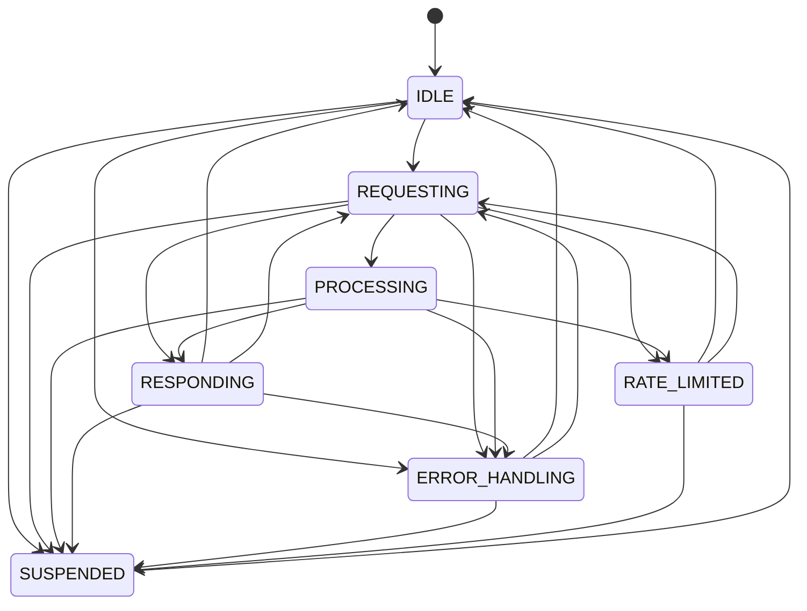
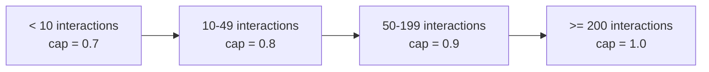
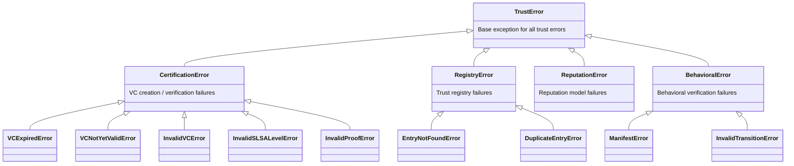
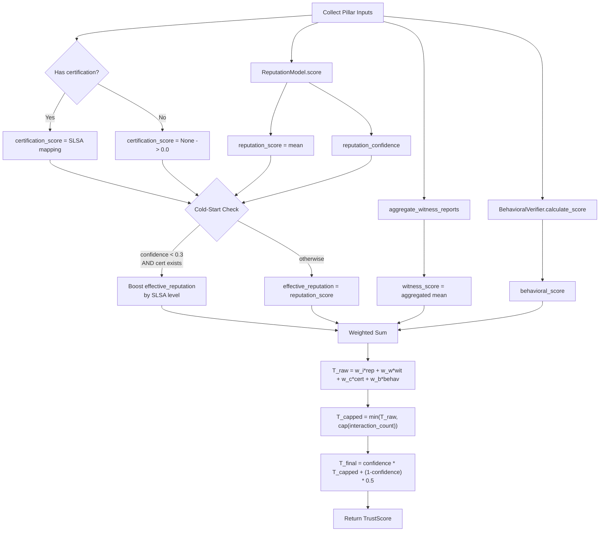

# QASP Trust Scoring Specification

**Version:** 1.0
**Status:** Living Document
**Module Path:** `src/qasp/trust/`

---

## 1. Overview

The QASP Trust Scoring system computes a composite trust score for agents by
combining four independent trust pillars. Each pillar captures a distinct
dimension of trustworthiness, and the composite formula applies anti-gaming
caps and confidence blending to produce a final score in the range `[0, 1]`.

### 1.1 Design Goals

1. **Bayesian uncertainty** -- reputation scores carry explicit variance and
   confidence, preventing premature trust escalation.
2. **Sybil resistance** -- interaction-count caps and collusion detection
   limit the effectiveness of fake-identity attacks.
3. **Cold-start safety** -- new agents without interaction history receive a
   neutral baseline, optionally boosted by verifiable certification.
4. **Composability** -- weights are configurable and validated at
   construction; every pillar can be evaluated independently.

### 1.2 Module Map

| File | Responsibility |
|------|---------------|
| `scoring.py` | Composite formula, trust caps, collusion detection |
| `reputation.py` | Beta-distribution reputation model, TRAVOS witness aggregation |
| `behavioral.py` | FSM state tracking, compliance scoring, capability manifests |
| `certification.py` | SLSA-based audit VCs (W3C VC Data Model v2.0) |
| `exceptions.py` | Exception hierarchy |
| `registry.py` | Thread-safe trust registry |

---

## 2. Composite Trust Formula

The composite trust score for an agent is computed by `TrustScorer.calculate()`.

### 2.1 Weighted Combination

```
T_raw(agent) = w_i * T_interaction
             + w_w * T_witness
             + w_c * T_certified
             + w_b * T_behavioral
```

**Default weights:**

| Symbol | Pillar | Default Weight |
|--------|--------|---------------|
| `w_i` | Interaction Reputation | 0.35 |
| `w_w` | Witness Reputation | 0.25 |
| `w_c` | Certification Score | 0.20 |
| `w_b` | Behavioral Compliance | 0.20 |

**Invariant:** `w_i + w_w + w_c + w_b = 1.0` (validated in `TrustScorer.__init__`
with tolerance `|sum - 1.0| <= 0.001`; raises `ValueError` otherwise).

When a pillar has no data (i.e., `certification_score is None` or
`witness_score is None`), its contribution defaults to `0.0`.

### 2.2 Anti-Gaming Trust Cap

Before confidence blending, the raw score is capped based on the number of
direct interactions observed:

```
T_capped = min(T_raw, cap(n))
```

| Interaction Count `n` | Trust Cap |
|-----------------------|-----------|
| `n < 10` | 0.7 |
| `10 <= n < 50` | 0.8 |
| `50 <= n < 200` | 0.9 |
| `n >= 200` | 1.0 |

This prevents agents from achieving maximum trust through a small number of
interactions, regardless of how favorable those interactions were.

### 2.3 Confidence Blending

The final score blends the capped score with a neutral prior of `0.5`,
weighted by the reputation confidence:

```
T(agent) = confidence * T_capped + (1 - confidence) * 0.5
```

**Effect:** When confidence is low (few observations), the score is pulled
toward the neutral value `0.5`. As confidence increases toward `1.0`, the
capped score dominates.

### 2.4 Output

The result is a frozen `TrustScore` dataclass:

| Field | Type | Description |
|-------|------|-------------|
| `overall` | `float` | Final blended composite score |
| `certification_component` | `float` | Raw certification pillar value |
| `reputation_component` | `float` | Effective reputation (after cold-start boost) |
| `behavioral_component` | `float` | Raw behavioral compliance score |
| `witness_component` | `float` | Raw witness pillar value |
| `confidence` | `float` | Reputation confidence used for blending |

The `meets_threshold(threshold) -> bool` method returns `True` when
`overall >= threshold`.

---

## 3. Pillar 1: Interaction Reputation (weight 0.35)

**Module:** `reputation.py`
**Class:** `ReputationModel`

### 3.1 Beta Distribution Model

Agent reputation is modeled as a Beta distribution `Beta(alpha, beta)` where:

- `alpha` counts pseudo-successes (positive evidence)
- `beta` counts pseudo-failures (negative evidence)

**Prior:** `alpha = 1.0, beta = 1.0` (uniform distribution -- maximum
ignorance).

**Bayesian update rule:**

```
success:  alpha <- alpha + 1
failure:  beta  <- beta  + 1
```

Each call to `ReputationModel.update(success, timestamp)` returns a **new**
`ReputationModel` instance (immutable update pattern).

### 3.2 Score Computation

`ReputationModel.score()` produces a `ReputationScore` with:

| Metric | Formula |
|--------|---------|
| Mean | `mu = alpha / (alpha + beta)` |
| Variance | `sigma^2 = (alpha * beta) / ((alpha + beta)^2 * (alpha + beta + 1))` |
| Confidence | `c = max(0, 1 - 2 / (alpha + beta))` |
| Sample Count | `max(0, floor(alpha + beta - 2))` |

### 3.3 Confidence Bounds

The `ReputationScore` provides 95% credible interval approximations:

```
lower_bound = max(0, mu - 2 * sqrt(sigma^2))
upper_bound = min(1, mu + 2 * sqrt(sigma^2))
```

### 3.4 Probability Above Threshold

`ReputationModel.probability_above(threshold)` computes:

```
P(X > threshold) = 1 - I_threshold(alpha, beta)
```

where `I_x(a, b)` is the **regularized incomplete beta function**, computed via
Lentz's continued fraction algorithm (modified, per Numerical Recipes) with:

- Symmetry relation for convergence: when `x > (a + 1) / (a + b + 2)`,
  use `I_x(a, b) = 1 - I_{1-x}(b, a)`
- Convergence tolerance: `|delta - 1| < 10^{-12}`
- Maximum iterations: 200
- Minimum denominator guard: `eps = 10^{-30}`

### 3.5 Time Decay

When `decay_rate > 0` and timestamps are provided, evidence decays
exponentially before each update:

```
dt = (t_new - t_last) / 86400       (days)
lambda(dt) = exp(-decay_rate * dt)

alpha' = 1.0 + (alpha - 1.0) * lambda(dt)
beta'  = 1.0 + (beta  - 1.0) * lambda(dt)
```

The decay is applied to the **excess** over the prior (i.e., only accumulated
evidence decays, not the prior itself). Setting `decay_rate = 0.0` disables
decay entirely.

---

## 4. Pillar 2: Witness Reputation (weight 0.25)

**Module:** `reputation.py`
**Function:** `aggregate_witness_reports()`

### 4.1 TRAVOS Credibility Filtering

Witness reports are filtered using the TRAVOS (Trust and Reputation model for
Agent-based Virtual OrganisationS) credibility algorithm.

**Input:** A list of `WitnessReport` records:

| Field | Type | Description |
|-------|------|-------------|
| `reporter_did` | `str` | DID of the reporting witness |
| `subject_did` | `str` | DID of the agent being reported on |
| `alpha` | `float` | Witness's Beta alpha parameter |
| `beta` | `float` | Witness's Beta beta parameter |
| `sample_count` | `int` | Number of interactions the witness observed |
| `timestamp` | `datetime` | When the report was generated |

### 4.2 Credibility Computation

For each witness report, credibility is computed as the probability that the
witness's Beta distribution agrees with the evaluator's own model within a
tolerance window `epsilon` (default `0.2`):

```
mu_own = own_model.score().mean
lo = max(0, mu_own - epsilon)
hi = min(1, mu_own + epsilon)

credibility = I_hi(alpha_w, beta_w) - I_lo(alpha_w, beta_w)
```

where `I_x(a, b)` is the regularized incomplete beta function and
`(alpha_w, beta_w)` are the witness's reported parameters.

### 4.3 Evidence Aggregation

If `credibility >= credibility_threshold` (default `0.8`), the witness's
evidence is included, weighted by its credibility:

```
alpha_agg += (alpha_w - 1.0) * credibility
beta_agg  += (beta_w  - 1.0) * credibility
```

Reports below the credibility threshold are discarded entirely. The
subtraction of `1.0` removes the witness's prior, incorporating only
their accumulated evidence.

### 4.4 Parameters

| Parameter | Default | Description |
|-----------|---------|-------------|
| `credibility_threshold` | `0.8` | Minimum credibility to accept a witness |
| `epsilon` | `0.2` | Tolerance window around own mean |

---

## 5. Pillar 3: Certification Score (weight 0.20)

**Module:** `certification.py`

### 5.1 SLSA Levels

Certification scores are derived from SLSA (Supply-chain Levels for Software
Artifacts) audit levels, defined as `SLSALevel(IntEnum)`:

| Level | Name | Description | Score |
|-------|------|-------------|-------|
| 1 | `LEVEL_1` | Basic provenance | 0.3 |
| 2 | `LEVEL_2` | Signed provenance, hosted build | 0.6 |
| 3 | `LEVEL_3` | Hardened builds, hermetic, reproducible | 0.9 |

The mapping from SLSA level to score is applied by the cold-start logic in
`TrustScorer.calculate()` (Section 7) and by the consuming application when
converting an `AuditVC` to a certification score.

### 5.2 Audit Verifiable Credential (AuditVC)

Audit results are encoded as W3C Verifiable Credentials (VC Data Model v2.0):

**JSON-LD Contexts:**
```
["https://www.w3.org/ns/credentials/v2", "https://qasp.ai/ns/audit/v1"]
```

**VC Types:**
```
["VerifiableCredential", "QASPAuditCredential"]
```

#### 5.2.1 Credential Subject (`AuditCredentialSubject`)

| Field | Type | Description |
|-------|------|-------------|
| `agent_did` | `DID` | DID of the audited agent |
| `audit_scope` | `str` | Description of what was audited |
| `code_version_hash` | `bytes` | SHA-384 hash of code version (48 bytes) |
| `audit_result` | `str` | Summary result of the audit |
| `slsa_level` | `SLSALevel` | SLSA certification level (1--3) |
| `findings` | `dict[str, str]` | Optional detailed audit findings |

#### 5.2.2 Proof (`MLDSAProof`)

| Field | Value |
|-------|-------|
| `type` | `"MLDSASignature2025"` |
| `proof_purpose` | `"assertionMethod"` |
| `verification_method` | `"{issuer_did}#key-1"` |
| `proof_value` | ML-DSA-65 signature over CBOR-encoded VC data |
| `created` | UTC timestamp of proof creation |

#### 5.2.3 VC Lifecycle

| Field | Description |
|-------|-------------|
| `id` | `urn:uuid:{uuid4}` -- unique identifier |
| `issuer_did` | DID of the auditor |
| `valid_from` | Start of validity (default: now) |
| `valid_until` | End of validity (default: 1 year from `valid_from`) |
| `nonce` | 16 bytes of random data for uniqueness |

**Verification** (`verify_audit_vc`) checks:
1. Proof type is `"MLDSASignature2025"`
2. Proof purpose is `"assertionMethod"`
3. VC is within its validity window (when `check_expiry=True`)
4. ML-DSA-65 signature verifies against the issuer's public key

**Serialization:** VCs support both JSON-LD (`to_json()`) and deterministic
CBOR (`to_cbor()` / `from_cbor()`) encoding.

---

## 6. Pillar 4: Behavioral Compliance (weight 0.20)

**Module:** `behavioral.py`
**Class:** `BehavioralVerifier`

### 6.1 Finite State Machine

Agent behavior is tracked as a deterministic FSM with 7 states.

#### 6.1.1 States (`BehaviorState`)

| State | Description |
|-------|-------------|
| `IDLE` | Agent is idle, no active operation |
| `REQUESTING` | Agent has initiated a request |
| `PROCESSING` | Request is being processed |
| `RESPONDING` | Agent is sending a response |
| `ERROR_HANDLING` | Agent is handling an error or timeout |
| `RATE_LIMITED` | Agent has been rate-limited |
| `SUSPENDED` | Agent has been suspended due to policy violation |

#### 6.1.2 Event Types (`BehaviorType`)

| Event Type | Description |
|------------|-------------|
| `REQUEST` | Agent sends a request |
| `RESPONSE` | Agent sends a response |
| `ERROR` | An error occurred |
| `TIMEOUT` | A timeout occurred |
| `RATE_LIMIT` | Rate limit triggered |
| `POLICY_VIOLATION` | Policy violation detected |

#### 6.1.3 Event-to-State Mapping

| Event Type | Target State |
|------------|-------------|
| `REQUEST` | `REQUESTING` |
| `RESPONSE` | `RESPONDING` |
| `ERROR` | `ERROR_HANDLING` |
| `TIMEOUT` | `ERROR_HANDLING` |
| `RATE_LIMIT` | `RATE_LIMITED` |
| `POLICY_VIOLATION` | `SUSPENDED` |

#### 6.1.4 State Transition Diagram



#### 6.1.5 Permitted Transitions Table

| From State | Permitted Targets |
|------------|-------------------|
| `IDLE` | `REQUESTING`, `ERROR_HANDLING`, `SUSPENDED` |
| `REQUESTING` | `PROCESSING`, `RESPONDING`, `ERROR_HANDLING`, `RATE_LIMITED`, `SUSPENDED` |
| `PROCESSING` | `RESPONDING`, `ERROR_HANDLING`, `RATE_LIMITED`, `SUSPENDED` |
| `RESPONDING` | `IDLE`, `REQUESTING`, `ERROR_HANDLING`, `SUSPENDED` |
| `ERROR_HANDLING` | `IDLE`, `REQUESTING`, `SUSPENDED` |
| `RATE_LIMITED` | `IDLE`, `REQUESTING`, `SUSPENDED` |
| `SUSPENDED` | `IDLE` |

Any transition not listed above is recorded as an **FSM violation**.

### 6.2 Compliance Score

The compliance score is calculated over a **sliding window** of the most
recent `window_size` events (default: 100).

```
score = 1.0 - (violation_weight / total_weight)
score = clamp(score, 0.0, 1.0)
```

Where for each event in the window:

| Event Category | Weight |
|----------------|--------|
| Normal event | `1.0` |
| `POLICY_VIOLATION` event | `severe_penalty` (default: `10.0`) |

An event contributes to `violation_weight` if it is either:
- An FSM violation (unpermitted state transition), OR
- A `POLICY_VIOLATION` event type

**Effect of severe penalty:** A single policy violation in a window of 100
normal events contributes weight `10.0` to violations out of total weight
`109.0`, yielding a score drop of approximately `0.092` -- roughly 10x the
impact of a single normal violation.

### 6.3 Capability Manifest

Agents declare their expected behavior patterns via a signed
`CapabilityManifest`:

| Field | Type | Description |
|-------|------|-------------|
| `agent_did` | `str` | The agent's DID |
| `declared_behaviors` | `tuple[tuple[str, str], ...]` | Declared state transition pairs `(from, to)` |
| `permitted_event_types` | `tuple[BehaviorType, ...]` | Event types the agent may emit |
| `public_key` | `bytes` | Agent's ML-DSA-65 public key |
| `signature` | `bytes` | ML-DSA-65 signature over CBOR-encoded payload |
| `created` | `datetime` | UTC timestamp of manifest creation |

**Signing:** The manifest payload is CBOR-encoded (agent_did,
declared_behaviors, permitted_event_types, public_key, created) and signed
with ML-DSA-65. Verification via `verify_manifest()` re-encodes the payload
and checks the signature against the embedded public key.

### 6.4 Anomaly Detection

`BehavioralVerifier.detect_anomalies()` returns all events that are either:
- FSM violations (unpermitted transitions), or
- `POLICY_VIOLATION` event types

`BehavioralVerifier.analyze_patterns()` returns a metrics dictionary:

| Metric | Description |
|--------|-------------|
| `total_events` | Total number of recorded events |
| `violation_count` | Number of FSM violations |
| `violation_rate` | `violation_count / total_events` |
| `request_rate` | Fraction of `REQUEST` events |
| `error_rate` | Fraction of `ERROR` events |
| `timeout_rate` | Fraction of `TIMEOUT` events |
| `policy_violation_rate` | Fraction of `POLICY_VIOLATION` events |
| `compliance_score` | `1.0 - violation_rate` |

---

## 7. Cold-Start Handling

When an agent has insufficient interaction history (`reputation_confidence < 0.3`)
but possesses a valid certification, the effective reputation is boosted based
on the SLSA level:

```
if reputation_confidence < 0.3 AND certification_score is not None:
    if certification_score >= 0.9:       # SLSA Level 3
        effective_reputation = max(reputation, 0.7)
    elif certification_score >= 0.6:     # SLSA Level 2
        effective_reputation = max(reputation, 0.5)
    elif certification_score >= 0.3:     # SLSA Level 1
        effective_reputation = max(reputation, 0.3)
```

This allows certified agents to bootstrap above the default `0.5` neutral
score without requiring interaction history, while uncertified agents must
accumulate evidence organically.

**Interaction with confidence blending:** Even with a cold-start boost, the
low confidence (< 0.3) still pulls the final score toward `0.5`. A Level 3
certified agent with zero interactions would receive:

```
T_raw   = 0.35 * 0.7 + 0.25 * 0 + 0.20 * 0.9 + 0.20 * 1.0 = 0.625
T_cap   = min(0.625, 0.7) = 0.625      (< 10 interactions, cap = 0.7)
conf    = 0.0                            (alpha=1, beta=1 -> confidence=0)
T_final = 0.0 * 0.625 + 1.0 * 0.5 = 0.5
```

The agent starts at neutral `0.5` but climbs faster as interactions accumulate
and confidence grows.

---

## 8. Anti-Gaming Measures

### 8.1 Interaction-Count Trust Caps

Trust caps (Section 2.2) prevent rapid trust escalation through a small number
of favorable interactions. Even if every interaction is a success, an agent
with fewer than 10 interactions cannot exceed a score of `0.7`.



### 8.2 Collusion Detection

The `detect_collusion()` function identifies groups of witnesses that report
suspiciously similar scores.

**Algorithm:**

1. Sort all witnesses by their reported score in ascending order.
2. Initialize a cluster with the first witness.
3. For each subsequent witness:
   - If `score - cluster_base_score <= (1 - threshold)`: add to current cluster.
   - Otherwise: close current cluster, start new cluster with this witness as base.
4. After iteration, close the final cluster.
5. Return all clusters with `len(cluster) >= min_cluster_size`.

**Parameters:**

| Parameter | Default | Description |
|-----------|---------|-------------|
| `threshold` | `0.95` | Similarity threshold; higher = more sensitive |
| `min_cluster_size` | `3` | Minimum witnesses in a cluster to flag |

**Example:** With `threshold = 0.95`, `max_diff = 0.05`. If witnesses report
scores `[0.81, 0.82, 0.83, 0.84, 0.50]`, the first four form a cluster
(all within `0.05` of the base `0.81`) and would be flagged as potential
collusion.

**Early exit:** If the total number of witnesses is less than
`min_cluster_size`, the function returns an empty list immediately.

### 8.3 Confidence Blending as Anti-Gaming

The confidence blending formula (Section 2.3) inherently resists gaming:

- A new agent (confidence near `0`) cannot exceed `0.5` regardless of
  reported pillar scores.
- Confidence only increases through genuine interaction accumulation
  (`confidence = 1 - 2 / (alpha + beta)`), requiring sustained activity.

---

## 9. Exception Hierarchy

All trust exceptions inherit from `TrustError`:



---

## 10. End-to-End Scoring Flow



---

## 11. Security Considerations

1. **Sybil attacks:** Interaction-count caps and collusion detection mitigate
   the impact of multiple fake identities inflating trust.

2. **Witness manipulation:** TRAVOS credibility filtering discards witness
   reports that diverge significantly from the evaluator's own observations,
   limiting the effectiveness of dishonest witnesses.

3. **Replay attacks:** Audit VCs include a 16-byte random nonce and a unique
   `urn:uuid` identifier. Time-based validity windows (`valid_from`,
   `valid_until`) prevent indefinite reuse.

4. **Signature security:** All cryptographic proofs (capability manifests,
   audit VCs) use ML-DSA-65, a post-quantum digital signature algorithm,
   providing security against both classical and quantum adversaries.

5. **Immutability:** `TrustScore`, `WitnessReport`, `BehaviorEvent`,
   `CapabilityManifest`, `AuditCredentialSubject`, `MLDSAProof`, and `AuditVC`
   are all frozen dataclasses, preventing post-construction mutation.

6. **Decay resistance:** Time decay applies only to accumulated evidence
   (excess over prior), ensuring the prior `Beta(1, 1)` is never eroded.
   This prevents artificial reputation inflation through carefully timed
   evidence injection.

---

## 12. Appendix: Mathematical Reference

### A. Beta Distribution

The probability density function of `Beta(alpha, beta)`:

```
f(x; alpha, beta) = x^(alpha-1) * (1-x)^(beta-1) / B(alpha, beta)
```

where `B(alpha, beta) = Gamma(alpha) * Gamma(beta) / Gamma(alpha + beta)`.

### B. Regularized Incomplete Beta Function

```
I_x(a, b) = B(x; a, b) / B(a, b)
```

Computed via continued fraction expansion (Lentz's modified algorithm):

```
I_x(a, b) = (x^a * (1-x)^b) / (a * B(a, b)) * CF(x, a, b)
```

With symmetry relation for numerical stability:

```
if x > (a + 1) / (a + b + 2):
    I_x(a, b) = 1 - I_{1-x}(b, a)
```

### C. Exponential Time Decay

```
lambda(dt) = exp(-r * dt)
```

where `r` is the decay rate and `dt` is elapsed time in days. Applied to
evidence excess: `alpha' = 1 + (alpha - 1) * lambda(dt)`.

### D. Confidence Formula

```
confidence = max(0, 1 - 2 / (alpha + beta))
```

This yields `0` for the prior `Beta(1, 1)` and approaches `1` as
observations accumulate. The threshold `alpha + beta > 2` is required for
positive confidence, meaning at least one observation is needed.
